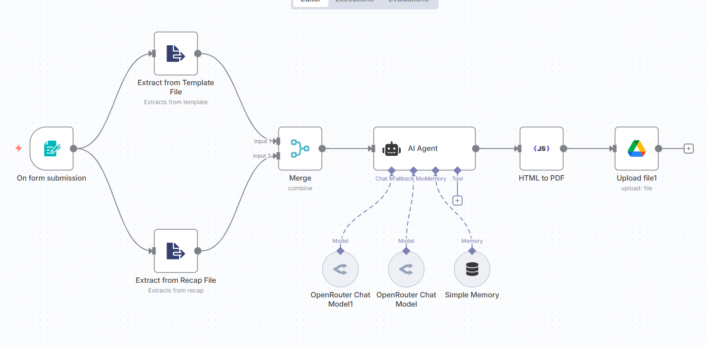

# Charter Party Automation Workflow

An intelligent n8n workflow that automates the processing of charter party documents by comparing template PDFs with recap PDFs and generating professionally formatted final documents with tracked changes.

## Architecture Overview



The workflow follows a streamlined process:
1. **Form Input** - Users upload template and recap PDF files
2. **PDF Text Extraction** - Both documents are processed to extract text content
3. **AI Processing** - Advanced language models analyze and merge the documents
4. **HTML Generation** - Creates formatted HTML with tracked changes
5. **PDF Conversion** - Converts HTML to professional PDF format
6. **Cloud Storage** - Automatically uploads final document to Google Drive

## Features

- **Automated Document Processing**: Intelligently merges template and recap documents
- **Change Tracking**: Visually highlights additions (green) and deletions (strikethrough)
- **Professional Formatting**: Generates properly structured legal documents
- **Cloud Integration**: Automatic upload to Google Drive
- **Web Form Interface**: Easy-to-use form for document submission
- **AI-Powered Analysis**: Uses advanced language models for accurate document processing

## Prerequisites

Before setting up this workflow, ensure you have:

- n8n instance (cloud or self-hosted)
- OpenRouter API account for AI processing
- Google Drive API credentials
- CustomJS API credentials for PDF conversion
- PDF Toolkit community node installed

## Installation & Setup

### 1. Install Required Community Nodes

In your n8n instance, install the following community node:

```
@custom-js/n8n-nodes-pdf-toolkit
```

**To install:**
1. Go to Settings → Community Nodes
2. Click "Install a community node"
3. Enter the package name: `@custom-js/n8n-nodes-pdf-toolkit`
4. Click Install

### 2. Set Up API Credentials

#### OpenRouter API Setup
1. Visit [OpenRouter](https://openrouter.ai/) and create an account
2. Generate an API key from your dashboard
3. In n8n, go to Credentials → Add Credential
4. Select "OpenRouter API"
5. Enter your API key
6. Save as "OpenRouter account 2"

#### Google Drive API Setup
1. Go to [Google Cloud Console](https://console.cloud.google.com/)
2. Create a new project or select existing one
3. Enable Google Drive API
4. Create OAuth 2.0 credentials:
   - Go to Credentials → Create Credentials → OAuth 2.0 Client ID
   - Choose "Web application"
   - Add authorized redirect URIs (your n8n instance URL + `/rest/oauth2-credential/callback`)
5. In n8n, add Google Drive OAuth2 API credential
6. Enter Client ID and Client Secret
7. Complete OAuth flow

#### CustomJS API Setup
1. Visit [CustomJS](https://customjs.com/) and create an account
2. Get your API credentials
3. In n8n, add CustomJS API credential
4. Enter your API key

### 3. Import the Workflow

1. Copy the contents of `Charter_Party_Automation.json`
2. In n8n, go to Workflows → Import from JSON
3. Paste the JSON content
4. Click Import

### 4. Configure Credentials

After importing, you'll need to assign the credentials to each node:

1. **OpenRouter Chat Model nodes**: Assign your OpenRouter API credential
2. **Google Drive node**: Assign your Google Drive OAuth2 credential  
3. **HTML to PDF node**: Assign your CustomJS API credential

## How to Use

### Step 1: Activate the Workflow
1. Open the imported workflow in n8n
2. Click the "Active" toggle to enable it
3. Note the webhook URL from the "On form submission" node

### Step 2: Access the Form
1. Copy the webhook URL from the form trigger node
2. Open the URL in your browser
3. You'll see a form with two file upload fields:
   - **Template PDF**: Upload your charter party template
   - **Recap PDF**: Upload the recap document with changes

### Step 3: Submit Documents
1. Select your template PDF file
2. Select your recap PDF file
3. Click Submit
4. The workflow will automatically process the documents

### Step 4: Retrieve Results
- The final processed document will be automatically uploaded to your Google Drive
- Look for a file named "Final_Filled.pdf" in your Drive root folder
- The document will include:
  - Filled commercial terms from the recap
  - Tracked changes (additions in green, deletions with strikethrough)
  - Professional legal document formatting

## API Endpoints

### Form Submission Webhook
- **Method**: POST
- **URL**: `{your-n8n-instance}/form/{webhook-id}`
- **Content-Type**: multipart/form-data
- **Fields**:
  - `Template_PDF`: PDF file (required)
  - `Recap_PDF`: PDF file (required)

### Response Format
The workflow processes asynchronously. Check your Google Drive for the completed document.

## Workflow Components

### 1. Form Trigger
- Accepts PDF file uploads
- Validates file types (.pdf only)
- Triggers the automation workflow

### 2. PDF Text Extraction
- Extracts text content from both uploaded PDFs
- Handles various PDF formats and layouts
- Preserves document structure

### 3. AI Processing
- Uses DeepSeek R1 and other advanced models
- Analyzes document differences
- Generates formatted HTML output
- Tracks changes and modifications

### 4. Document Generation
- Converts AI output to professional HTML
- Applies legal document styling
- Maintains proper formatting and structure

### 5. PDF Conversion
- Converts HTML to high-quality PDF
- Preserves formatting and styling
- Optimizes for printing and digital viewing

### 6. Cloud Storage
- Automatically uploads to Google Drive
- Uses configurable folder structure
- Maintains file naming conventions

## Limitations

### Technical Limitations
- **PDF Quality**: Complex layouts or scanned documents may not extract perfectly
- **File Size**: Large PDFs (>50MB) may cause processing delays
- **Language Support**: Optimized for English legal documents
- **Processing Time**: Complex documents may take 2-5 minutes to process

### AI Model Limitations
- **Context Window**: Very long documents may be truncated
- **Accuracy**: AI interpretation may occasionally miss nuanced legal changes
- **Formatting**: Complex table structures may not render perfectly
- **Language Models**: Dependent on external API availability and rate limits

### Integration Limitations
- **Google Drive**: Requires proper OAuth setup and permissions
- **API Dependencies**: Relies on external services (OpenRouter, CustomJS)
- **Network**: Requires stable internet connection for cloud processing
- **Credentials**: All API credentials must be properly configured

### Document Limitations
- **Template Format**: Works best with structured charter party templates
- **Change Detection**: May not catch all subtle modifications
- **Legal Accuracy**: Generated documents should be reviewed by legal professionals
- **Version Control**: No built-in document versioning system

## Troubleshooting

### Common Issues

**Workflow not triggering:**
- Check if workflow is activated
- Verify webhook URL is accessible
- Ensure form fields match expected names

**PDF extraction fails:**
- Verify PDF files are not password-protected
- Check file size limits
- Ensure PDFs contain extractable text (not just images)

**AI processing errors:**
- Verify OpenRouter API credentials
- Check API rate limits and quotas
- Ensure sufficient credits in OpenRouter account

**Google Drive upload fails:**
- Verify OAuth credentials are valid
- Check Google Drive API permissions
- Ensure sufficient storage space

**PDF conversion issues:**
- Verify CustomJS API credentials
- Check HTML output format
- Ensure API service is available

### Support

For technical issues:
1. Check n8n execution logs for detailed error messages
2. Verify all credentials are properly configured
3. Test individual nodes to isolate problems
4. Review API service status pages

## Contributing

To improve this workflow:
1. Fork the repository
2. Make your changes to the JSON workflow
3. Test thoroughly with sample documents
4. Submit a pull request with detailed description

## License

This workflow is provided as-is for automation purposes. Users are responsible for ensuring compliance with legal and regulatory requirements when processing legal documents.